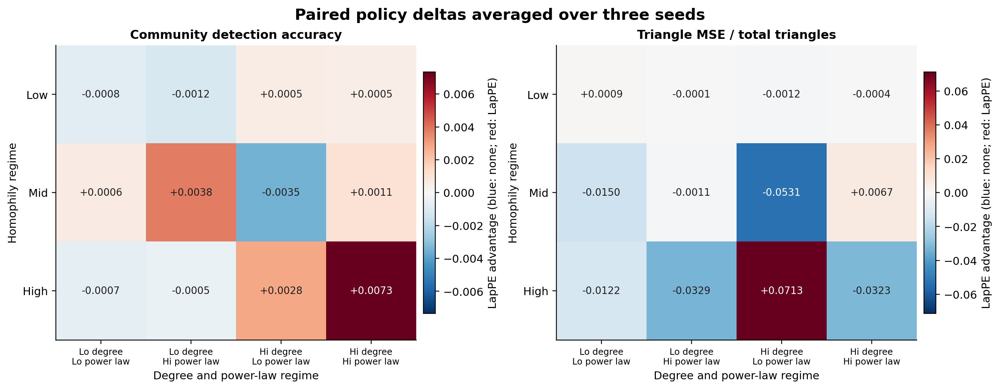
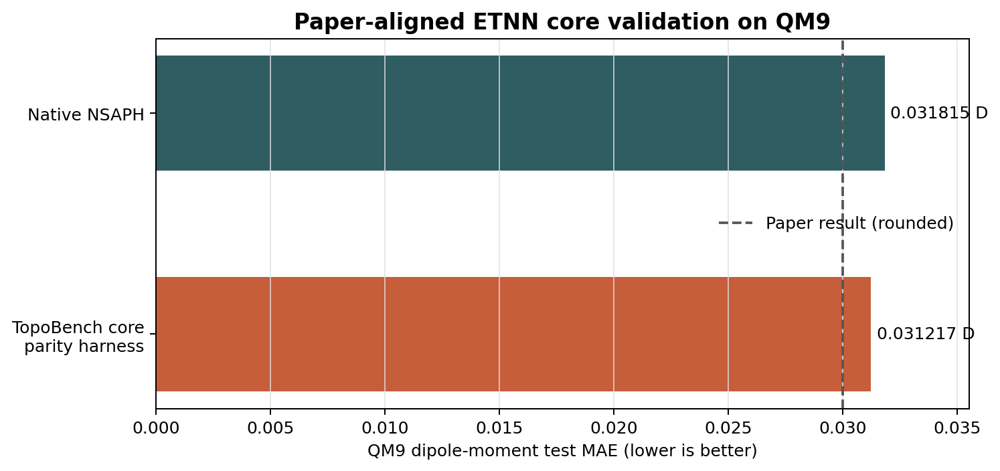

# ETNN Coordinate Policy

**A TopoBench-native implementation of E(n)-Equivariant Topological Neural
Networks across coordinate-free, structural-coordinate, and physical-coordinate
settings.**

This project tells the implementation story behind the ETNN Coordinate Policy,
the joint Track 2 winner of the 2026 Topological Deep Learning Challenge. The
work adapts the E(n)-Equivariant Topological Neural Network (ETNN) architecture
to TopoBench while making the meaning of coordinates an explicit, reproducible
model choice.

[Read the technical report](report/from-equations-to-code.pdf) |
[View the upstream pull request](https://github.com/geometric-intelligence/TopoBench/pull/391) |
[Inspect the implementation](https://github.com/grvkhnl/TopoBench/blob/a0bd4113f431efce8eb1ca38dcfe4837ab995779/topobench/nn/backbones/combinatorial/etnn_coordinate_policy.py) |
[Open the comparison notebook](https://github.com/grvkhnl/TopoBench/blob/a0bd4113f431efce8eb1ca38dcfe4837ab995779/2026_tdl_challenge/submissions/etnn_coordinate_policy_comparison.ipynb)

> **Upstream status:** The implementation is available at the immutable fork
> revision `a0bd4113f431efce8eb1ca38dcfe4837ab995779`. TopoBench PR #391 remains
> open for upstream review, so this repository should not be interpreted as an
> official TopoBench release.

## Why a coordinate policy?

ETNN combines message passing over cells of a combinatorial complex with
geometric information. Not every dataset provides the same kind of geometry:
some provide no coordinates, some admit graph-derived structural embeddings,
and molecular datasets provide physical Euclidean positions. Treating those
cases as interchangeable would hide a scientific assumption inside the model.

The implementation therefore exposes one ETNN backbone with three explicit
policies:

| Policy | Coordinate source | Intended setting |
| --- | --- | --- |
| `none` | No coordinates | Graphs with no defensible coordinate frame |
| `structural_lappe` | Laplacian positional encodings | Coordinate-free graphs with an explicit structural embedding |
| `physical` | Measured Euclidean positions | Molecules and other physical complexes |

All policies share rank-wise feature states, typed sparse relations,
relation-specific gated messages, and residual cell updates. The physical
policy additionally derives invariant cell geometry and can update rank-0
coordinates through an E(n)-equivariant radial rule.

## What was implemented

- A unified rank-wise ETNN backbone for combinatorial complexes.
- Sparse typed message routes across adjacency and incidence relations.
- Explicit coordinate-free, structural, and physical data contracts.
- Laplacian structural coordinates lifted from vertices to higher-rank cells.
- Physical cell centroids, diameters, and directed Hausdorff-style invariants.
- Optional equivariant coordinate updates with geometry recomputed per layer.
- Focused tests, public configurations, and a reviewer-facing comparison
  notebook integrated with TopoBench.

The full design rationale, mathematical notation, implementation excerpts, and
limitations are developed in
[*From Equations to Code*](report/from-equations-to-code.pdf).

## Validation

The validation strategy separates claims that require different data regimes:

- **GraphUniverse** evaluates the coordinate-free and structural-coordinate
  policies across controlled graph regimes.
- **QM9** exercises genuine physical coordinates, invariant geometry, and
  coordinate dynamics unavailable in GraphUniverse.
- **Protocol-matched parity auditing** compares the TopoBench model core with
  the pinned official NSAPH implementation under matched data, invariants,
  architecture, optimization, and training protocol.



The GraphUniverse comparison shows a task-dependent trade-off rather than a
universal structural-coordinate advantage. Structural coordinates trend
higher on community detection, while the coordinate-free policy has lower
triangle-counting error in the aggregated comparison.



Under the matched 1,000-epoch QM9 protocol, the native reference reaches a test
MAE of 0.031815 Debye and the TopoBench model-core harness reaches 0.031217
Debye. This is evidence of close model-core parity, not a claim that the generic
TopoBench lifting exactly reproduces the paper's molecule-specific complex.

## Repository contents

```text
.
├── README.md
├── CITATION.cff
├── LICENSE
├── REPRODUCING.md
├── THIRD_PARTY_NOTICES.md
└── report
    ├── from-equations-to-code.pdf
    ├── from-equations-to-code.qmd
    ├── references.bib
    ├── figures
    └── fonts
```

The production implementation and tests remain in the TopoBench fork rather
than being duplicated here. The immutable source links below preserve the
software context used by the report:

- [ETNN coordinate-policy backbone](https://github.com/grvkhnl/TopoBench/blob/a0bd4113f431efce8eb1ca38dcfe4837ab995779/topobench/nn/backbones/combinatorial/etnn_coordinate_policy.py)
- [Focused backbone tests](https://github.com/grvkhnl/TopoBench/blob/a0bd4113f431efce8eb1ca38dcfe4837ab995779/test/nn/backbones/combinatorial/test_etnn_coordinate_policy.py)
- [Public model configurations](https://github.com/grvkhnl/TopoBench/tree/a0bd4113f431efce8eb1ca38dcfe4837ab995779/configs/model/combinatorial)
- [Executed comparison notebook](https://github.com/grvkhnl/TopoBench/blob/a0bd4113f431efce8eb1ca38dcfe4837ab995779/2026_tdl_challenge/submissions/etnn_coordinate_policy_comparison.ipynb)

## Attribution

The ETNN architecture was introduced by Battiloro et al. The official NSAPH
implementation is the behavioral reference used for the parity study, and
TopoBench provides the surrounding data, lifting, model, and evaluation
framework. See the report bibliography and
[third-party notices](THIRD_PARTY_NOTICES.md) for complete attribution.

## Citation

Citation metadata are provided in [`CITATION.cff`](CITATION.cff). Until the
work receives an archival identifier, cite this repository together with the
original ETNN paper and TopoBench.

## License

Original material in this repository is released under the MIT License.
Quoted or adapted TopoBench code retains its original MIT notice. Bundled
JetBrains Mono Nerd Font files are distributed under the SIL Open Font License;
see [`report/fonts/OFL.txt`](report/fonts/OFL.txt).
