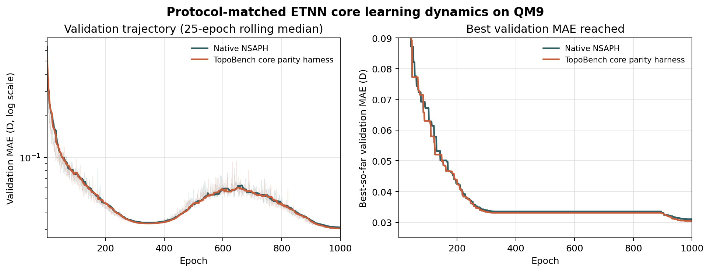

\clearpage

## Status and scope {.unnumbered}

**Document type:** Technical implementation report  
**Implementation revision:** `a0bd4113f431efce8eb1ca38dcfe4837ab995779`  
**Reference implementation revision:** NSAPH commit `639e35e`  
**Report version:** 1.0

The corresponding implementation is submitted to TopoBench in
[PR #391](https://github.com/geometric-intelligence/TopoBench/pull/391). The
immutable revision cited above is hosted in the author's public TopoBench fork
while upstream review remains open.

This implementation was developed for Track 2 of the **2026 Topological Deep
Learning Challenge: Bridging the Gap**, which asked participants to integrate
topological neural networks into a shared TopoBench evaluation pipeline
[@tdlchallenge2026]. The challenge provided the setting and common benchmark;
the coordinate-policy abstraction, physical-coordinate extension, and layered
validation strategy described here are the implementation developed for that
setting.

The original architecture, mathematical framework, and equivariance results
are described in the ETNN paper [@battiloro2024etnn]. The official
implementation maintained by the NSAPH project is used as the reference for
software-level behavior not fully fixed by the paper
[@nsaph_etnn_software]. TopoBench supplies the modular data, lifting, model,
and readout contracts into which the implementation is integrated
[@telyatnikov2025topobench].

Short excerpts from the TopoBench implementation are reproduced to connect the
mathematics to executable code. The repository is distributed under the MIT
License; copyright remains with the TopoBench Team. Excerpts are lightly elided
only where surrounding validation or documentation would obscure the specific
mechanism under discussion.

Paper-derived formulas carry point-of-use citations with original locators;
uncited displays are TopoBench-specific definitions or derivations.

# Why ETNN requires more than ordinary graph message passing

Graph neural networks normally associate a feature vector with every vertex
and exchange messages along edges. This representation is natural for pairwise
interactions, but it does not give higher-order entities an independent state.
A combinatorial complex can represent vertices, edges, faces, rings,
functional groups, hyperedges, and other multi-way objects as **cells** with an
integer rank [@hajij2022tdl]. ETNN performs message passing over those cells
while incorporating geometric information from rank-0 Euclidean coordinates
[@battiloro2024etnn].

Using the combinatorial-complex formalism adopted by ETNN
[@hajij2022tdl; @battiloro2024etnn, sec. 2], let

$$
\mathcal{C} = \bigsqcup_{r=0}^{R}\mathcal{C}_r
$$

be a combinatorial complex whose rank-$r$ cells form the set
$\mathcal{C}_r$. The symbol $R$ denotes the
largest represented rank, and $n_r = |\mathcal{C}_r|$ denotes the number of
rank-$r$ cells. Every cell $c\in\mathcal{C}_r$ carries a feature vector
$x_c\in\mathbb{R}^{d_r}$. In batched tensor form,

$$
X_r\in\mathbb{R}^{n_r\times d_r}.
$$

ETNN has two coupled responsibilities:

1. update features on cells of every visible rank through typed topological
   relations; and
2. when physical coordinates exist, derive invariant geometric channels and
   optionally update rank-0 positions equivariantly.

The first responsibility resembles heterogeneous message passing. The second
is what makes a physical ETNN an E(n)-equivariant geometric model rather than
only a topological neural network.

## A running picture: atoms, bonds, and higher-order cells

It is useful to keep one concrete complex in mind. Consider three atoms joined
in a triangle. An ordinary graph stores three vertices and three pairwise
edges. A combinatorial complex can treat the same objects as cells at different
ranks:

- the atoms are rank-0 cells;
- the bonds are rank-1 cells; and
- the triangular ring, or another chosen molecular region, is a rank-2 cell.

The rank does not mean that one object is more important than another. It says
how the objects are organized: a bond contains atoms, and a face or region can
contain bonds. Each cell can carry its own state. Atom features might describe
chemical species, bond features might describe bond type, and a higher-rank
feature might summarize a ring or multi-atom interaction.

This picture turns ETNN implementation into three recurring questions:

1. **Who can communicate?** Topological relations decide whether information
   moves atom-to-atom, atom-to-bond, bond-to-ring, or in the reverse direction.
2. **What context accompanies a message?** Depending on the coordinate policy,
   an interaction may carry only a topological value, a structural distance, or
   physical summaries of the participating cells.
3. **What is allowed to move?** Scalar features are updated in every policy;
   physical rank-0 coordinates may also be updated, but only through an
   E(n)-equivariant rule.

The rest of the report answers these questions in that order. The tensor and
sparse-matrix details are implementations of this conceptual picture, not
separate machinery.

## What E(n)-equivariance means here

The Euclidean group E(n) contains translations, rotations, and reflections in
$n$-dimensional space. Following the group action used in the original ETNN
formulation [@battiloro2024etnn, eq. 5], a transformation acts on a rank-0
position $p_i\in\mathbb{R}^n$ as

$$
p_i \longmapsto Qp_i+t,
\qquad Q^{\mathrm{T}}Q=I,
$$

where $Q$ is orthogonal and $t$ is a translation vector. Scalar cell
features should remain invariant, while an updated coordinate should transform
in the same way as the input coordinate. Relative vectors transform as

$$
(p_i-p_j)\longmapsto Q(p_i-p_j),
$$

and Euclidean distances remain unchanged. ETNN uses invariant scalars to
control vector-valued coordinate displacements, following the same basic
equivariant construction used by E(n)-equivariant graph networks
[@satorras2021egnn].

# From TopoBench batches to rank-wise ETNN state

The mathematical complex must first become a collection of tensors that a
neural network can process. TopoBench performs the graph-to-complex lifting and
delivers cell features and sparse relations. ETNN's first task is therefore not
to discover the complex, but to translate this framework representation into
rank-indexed states and directed message edges without losing cell identity.

## The batch contract

After a graph or another input domain is lifted to a combinatorial complex,
TopoBench exposes rank-wise tensors:

```text
x_0, x_1, ..., x_R
incidence_1, incidence_2, ..., incidence_R
up_adjacency_0, up_adjacency_1, ...
up_incidence_0, down_incidence_1, ...
```

The feature tensors contain one row per real cell. Sparse relation matrices use
receiver cells on rows and sender cells on columns. ETNN instead consumes edge
indices in `[sender, receiver]` order. Converting the representation correctly
is therefore part of the model contract, not incidental tensor plumbing.

For relation $N$, let

$$
A_N\in\mathbb{R}^{n_c\times n_d}
$$

encode messages from sender rank $d$ to receiver rank $c$. A nonzero entry
$(A_N)_{ji}$ creates the directed message edge $i\to j$. The implementation
coalesces the sparse tensor, removes explicitly stored zeros, converts matrix
coordinates to sender/receiver indices, and preserves the scalar relation
value where the selected coordinate policy requires it.

```python
def _neighborhood_to_edge_index(
    batch,
    neighborhood: str,
    src_rank: int,
    dst_rank: int,
    device: torch.device,
    dtype: torch.dtype,
    num_src_cells: int | None = None,
    num_dst_cells: int | None = None,
) -> tuple[torch.Tensor, torch.Tensor]:
    sparse_neighborhood = getattr(batch, neighborhood).coalesce()
    indices = sparse_neighborhood.indices().long()
    values = sparse_neighborhood.values()

    nonzero_mask = values != 0
    indices = indices[:, nonzero_mask]
    values = values[nonzero_mask]

    receiver = dst_map[indices[0]]
    sender = src_map[indices[1]]
    valid_edge_mask = (receiver >= 0) & (sender >= 0)

    edge_index = torch.stack(
        [sender[valid_edge_mask], receiver[valid_edge_mask]], dim=0
    ).to(device)
    edge_attr = values[valid_edge_mask].view(-1, 1).to(
        device=device, dtype=dtype
    )
    return edge_index, edge_attr
```

The complete implementation additionally checks for missing relation tensors,
returns shape-stable empty tensors, and compacts placeholder slots introduced
when a batch contains a graph with no cells at a requested rank.

## Why placeholder compaction matters

Sparse batching and dense feature batching do not always have identical row
counts. A graph with no rank-2 cells may receive one sparse placeholder slot so
that block-diagonal relation matrices can be assembled, while `x_2` contributes
zero feature rows. Directly indexing `x_2` with sparse indices would then be
incorrect.

The helper `_sparse_axis_to_feature_index` reconstructs a mapping from sparse
slots to real feature rows using `batch_r`. Real cells receive compact indices;
placeholder slots receive `-1`; and edges touching placeholders are discarded.
This explicit proof of alignment is preferable to silently clipping indices or
assuming that every graph contains every visible rank.

# Typed topological routes

The word *edge* can become ambiguous once the model contains cells of several
ranks. A graph edge is a rank-1 object, while a message edge is simply a
directed communication link between two cells. These are not the same thing.
For example, an atom may send a message to an incident bond, two bonds may
communicate because they bound the same face, and that face may send information
back to each bond.

ETNN therefore does not collapse every communication pattern into one
homogeneous relation. A neighborhood name identifies both the topological rule
and the sender/receiver rank pair. For example:

| Neighborhood | Sender rank | Receiver rank | Interpretation |
|---|---:|---:|---|
| `up_adjacency-0` | 0 | 0 | vertex-to-vertex adjacency |
| `up_adjacency-1` | 1 | 1 | edge-to-edge upper adjacency |
| `up_incidence-0` | 0 | 1 | vertex-to-edge incidence |
| `down_incidence-1` | 1 | 0 | edge-to-vertex incidence |
| `up_incidence-1` | 1 | 2 | edge-to-face incidence |
| `down_incidence-2` | 2 | 1 | face-to-edge incidence |

TopoBench parses these names into ordered routes. The implementation preserves
the configuration order because the destination update MLP observes incoming
messages through concatenation. Changing route order after initialization
would change the semantic meaning of input channels without changing their
shape.

For every relation type $N$, ETNN creates a distinct message module
$\psi_N$. For every destination rank $r$, it creates a rank-specific update
module $\beta_r$. This separation lets two relations connecting the same pair
of ranks learn different transformations.

# Shared ETNN feature message passing

Once a route determines who communicates, the message layer decides what one
cell should tell another. The same high-level recipe is used for every route:
combine the sender state, receiver state, and scalar relation attributes;
transform that combined description; learn how strongly the interaction should
count; and sum the resulting messages at the receiver. Separate parameters let
atom-to-bond communication learn a different function from bond-to-face
communication even though both use this recipe.

## Relation-specific messages

The following relation-resolved form implements the feature update in the
original ETNN formulation [@battiloro2024etnn, eq. 6]. Let
$h_d^{(\ell)}\in\mathbb{R}^h$ and
$h_c^{(\ell)}\in\mathbb{R}^h$ denote sender and receiver embeddings at layer
$\ell$. Let $e_{d,c,N}^{(\ell)}\in\mathbb{R}^{q_N}$ be the scalar edge
attributes supplied by the coordinate policy. The ungated edge message is

$$
\widetilde m_{d,c,N}^{(\ell)} =
\phi_N^{(\ell)}\!\left(
  \left[
    h_d^{(\ell)}\,\Vert\,
    h_c^{(\ell)}\,\Vert\,
    e_{d,c,N}^{(\ell)}
  \right]
\right),
$$

where $\Vert$ denotes concatenation and
$\phi_N^{(\ell)}:\mathbb{R}^{2h+q_N}\to\mathbb{R}^{h}$ is a
relation-specific MLP.

Not every topologically permitted interaction is equally informative. The ETNN
paper specifies adjacency-wise weighted aggregation, with nonnegative scalar
weights produced from each message [@battiloro2024etnn, app. K]. The official
NSAPH implementation realizes that mechanism as a learned scalar edge gate.
The gate behaves like a soft relevance score between zero and one: it can
suppress a message without removing the underlying relation from the complex.
The TopoBench port retains that behavior:

$$
g_{d,c,N}^{(\ell)} =
\sigma\!\left(
  W_{g,N}^{(\ell)}\widetilde m_{d,c,N}^{(\ell)}+b_{g,N}^{(\ell)}
\right),
$$

$$
m_{c,N}^{(\ell)} =
\sum_{d\in N(c)}
g_{d,c,N}^{(\ell)}\widetilde m_{d,c,N}^{(\ell)}.
$$

Here $W_{g,N}^{(\ell)}\in\mathbb{R}^{1\times h}$,
$b_{g,N}^{(\ell)}\in\mathbb{R}$, $\sigma$ is the logistic sigmoid, and
$N(c)$ denotes the senders connected to receiver $c$ by relation $N$.

```python
sender, receiver = edge_index
state = torch.cat(
    [x_src[sender], x_dst[receiver], edge_attr.to(x_dst.dtype)],
    dim=-1,
)
messages = self.message_mlp(state)
messages = messages * self.edge_gate(messages)
out.index_add_(0, receiver, messages)
```

`index_add_` implements sum aggregation without materializing a dense relation
matrix. Empty relations return an all-zero tensor with one row per destination
cell, preserving the downstream update shape.

## Rank-wise residual updates

Suppose rank $r$ receives the ordered relations
$N_1,\ldots,N_{k_r}$. The residual update below is the TopoBench tensor form of
the rank- and neighborhood-dependent ETNN update
[@battiloro2024etnn, eq. 6 and app. K]:

$$
h_c^{(\ell+1)} = h_c^{(\ell)} +
\beta_r^{(\ell)}\!\left(
  h_c^{(\ell)}\,\Vert\,
  m_{c,N_1}^{(\ell)}\,\Vert\,\cdots\,\Vert\,
  m_{c,N_{k_r}}^{(\ell)}
\right).
$$

Because incoming relation counts are known at construction time, the input
width of $\beta_r$ is $(1+k_r)h$. The implementation builds an update MLP
for every visible rank, including a rank with no incoming configured relation.
Such a rank still receives a learned residual transformation of its current
state rather than causing a missing-module failure.

```python
incoming_counts = defaultdict(int)
for _, dst_rank in self.routes:
    incoming_counts[dst_rank] += 1

self.update = nn.ModuleDict(
    {
        str(rank): _make_mlp(
            in_channels=(1 + incoming_counts[rank]) * hidden_channels,
            hidden_channels=hidden_channels,
            out_channels=hidden_channels,
            dropout=dropout,
            activation=activation,
            use_batch_norm=use_batch_norm,
        )
        for rank in range(max_rank + 1)
    }
)
```

# Why coordinates are an explicit policy

An implementation that simply checks whether a batch happens to contain a
`pos` attribute can silently change model semantics across datasets. A field
named `pos` may contain a physical configuration, a visualization layout, or a
precomputed embedding. Conversely, a coordinate-free dataset should not be
assigned fabricated physical geometry merely to satisfy an API.

The backbone therefore requires one explicit policy:

| Policy | Coordinate source | Edge attributes | Coordinate dynamics |
|---|---|---|---|
| `none` | none | sparse relation value | none |
| `structural_lappe` | graph Laplacian eigenvectors | relation value and squared structural distance | fixed |
| `physical` | rank-0 Euclidean positions | physical cell invariants | optional equivariant update |

This is an implementation extension, not a claim that all three modes realize
the same physical symmetry. Only the physical policy uses genuine Euclidean
coordinates and implements coordinate dynamics. The structural policy is
invariant to orthogonal changes of basis in its chosen pseudo-coordinate frame,
but that does not endow the original graph with a physical E(n) action.

The policy is validated during construction. Configuration errors fail early:
`pos_update=True` is rejected outside physical mode, physical invariant
normalization is rejected for nonphysical policies, and the coordinate-update
relation must be a configured rank-0-to-rank-0 route.

# Policy 1: no coordinates

The coordinate-free mode isolates ETNN's typed topological feature update. For
each nonzero sparse relation entry,

$$
e_{d,c,N} = \begin{bmatrix}a_{d,c,N}\end{bmatrix},
$$

where $a_{d,c,N}$ is the stored relation value. No Euclidean claim is made,
and no coordinate tensor is required.

This mode is useful when the data expresses topology but no meaningful
physical frame. It is intentionally conservative: absence of geometry changes
the model's information set rather than triggering an undocumented surrogate.

```python
if self.coordinate_policy == "none":
    return edge_attr
```

# Policy 2: structural Laplacian coordinates

Some datasets have no physical coordinates but still contain meaningful notions
of graph position. A vertex near the center of a community, for example, plays
a different structural role from a vertex near its boundary even if neither
has a location in Euclidean space. Laplacian positional encodings turn this
global connectivity information into numerical pseudo-coordinates. They let the
message function compare structural position while keeping the distinction
between graph geometry and physical geometry explicit.

## Rank-0 pseudo-coordinates

The graph Laplacian can be viewed as an operator that measures how a signal
varies across adjacent vertices. Its low-frequency eigenvectors are smooth
signals over the graph: nearby or similarly situated vertices tend to receive
similar values. Selecting several eigenvectors assigns every vertex a short
vector describing its position within these global structural patterns
[@dwivedi2023benchmarking]. Let

$$
P_0\in\mathbb{R}^{n_0\times k}
$$

contain $k$ selected eigenvectors, with row $p_v$ assigned to rank-0 cell
$v$. These values encode graph structure, not physical position.

The transform stores the matrix separately from input features. Setting
`concat_to_x=false` is important: concatenating the eigenvectors into `x_0`
would change the feature encoder and prevent the backbone from controlling how
structural coordinates enter messages.

## Lifting coordinates to higher-rank cells

Only vertices receive Laplacian coordinates directly. A bond, face, or other
higher-rank cell still needs a structural location if it is to participate in
distance-aware messages. The natural construction is a barycenter: a bond is
placed at the average of its endpoint coordinates, and a face is placed at the
average of its boundary-cell coordinates. Recursively, for rank $r>0$, the
implementation averages the coordinates of incident rank-$(r-1)$ cells. Let
$B_r\in\mathbb{R}^{n_{r-1}\times n_r}$ be the incidence matrix between
ranks $r-1$ and $r$. For a rank-$r$ cell $c$,

$$
p_c^{(r)} =
\frac{
  \sum_{d=1}^{n_{r-1}} |(B_r)_{dc}|\,p_d^{(r-1)}
}{
  \sum_{d=1}^{n_{r-1}} |(B_r)_{dc}|
}.
$$

Absolute incidence values are used because orientation signs should not cancel
coordinates during barycentric averaging.

```python
indices = incidence.indices()
values = incidence.values().abs().to(lower_coordinates.dtype)
lower_idx, cell_idx = indices

coordinates.index_add_(
    0,
    cell_idx,
    lower_coordinates[lower_idx] * values.unsqueeze(-1),
)
weights.index_add_(0, cell_idx, values.unsqueeze(-1))
return coordinates / weights.clamp_min(torch.finfo(weights.dtype).eps)
```

## Structural distance channels

These pseudo-coordinates are never shown to the model component-by-component.
Doing so would make predictions depend on arbitrary eigenvector signs or basis
choices. Instead, the model receives their squared separation, which answers a
more stable question: *how far apart are these two cells in the selected
structural embedding?* For a relation edge from cell $d$ to cell $c$, the
policy supplies

$$
e_{d,c,N} =
\begin{bmatrix}
a_{d,c,N} \\
\lVert p_d-p_c\rVert_2^2
\end{bmatrix}.
$$

The squared distance is invariant under a consistent translation and
orthogonal transformation of the structural frame. It is consequently
insensitive to global eigenvector sign flips and to orthogonal basis changes
inside a degenerate eigenspace, provided the frame is transformed consistently
for the entire complex.

```python
sender, receiver = edge_index
delta = src_coordinates[sender] - dst_coordinates[receiver]
distance_attr = delta.pow(2).sum(dim=-1, keepdim=True)
return torch.cat([edge_attr, distance_attr], dim=-1)
```

The policy deliberately keeps these coordinates fixed. Updating Laplacian
eigenvectors as though they were physical positions would destroy their
meaning as a deterministic structural encoding.

# Policy 3: physical coordinates

Physical mode begins from a different premise: rank-0 coordinates are measured
positions in Euclidean space, such as atomic coordinates in a molecule. A
higher-rank cell does not usually arrive with its own position. It represents a
set of vertices, so its geometry must be derived from that set. The
implementation first reconstructs which vertices belong to each cell and then
summarizes the resulting point set in ways that are unchanged by translation,
rotation, or reflection.

## Recovering cell membership

The physical policy starts from rank-0 positions

$$
P\in\mathbb{R}^{n_0\times n},
$$

where row $p_i$ is the physical coordinate of vertex $i$. Higher-rank cell
geometry depends on which rank-0 vertices belong to each cell. TopoBench
provides consecutive incidence matrices rather than a direct vertex-to-cell
membership matrix at every rank, so the implementation reconstructs

$$
M_r\in\{0,1\}^{n_0\times n_r}.
$$

The base case is $M_0=I_{n_0}$. Recursively,

$$
M_r = \mathbf{1}\!\left(M_{r-1}|B_r|>0\right),
$$

where the indicator is applied elementwise. This computes transitive rank-0
membership while ignoring incidence orientation signs.

Dense membership is simple and robust for small and medium physical complexes,
but it scales as $O(n_0n_r)$ per rank. That trade-off is documented rather
than hidden: a large-complex implementation should replace it with sparse
membership propagation.

## Centroids and diameters

Two coarse summaries establish where a cell lies and how large it is. The
centroid is the average position of its vertices; the diameter is the largest
distance between any two of them. Thus an atom is a zero-diameter singleton, a
bond has its midpoint as centroid and bond length as diameter, and a larger cell
spans the vertices on its boundary. Neither summary depends on the orientation
of the global coordinate frame. The centroid construction specializes the
permutation-invariant geometric summary used in the ETNN paper
[@battiloro2024etnn, eq. 10].

For a cell $c$, let

$$
V(c)=\{i:(M_r)_{ic}=1\}
$$

be its incident rank-0 vertices. Its centroid is

$$
\mu_c = \frac{1}{|V(c)|}\sum_{i\in V(c)}p_i,
$$

and its diameter is

$$
\delta_c = \max_{i,j\in V(c)}\lVert p_i-p_j\rVert_2.
$$

Singleton cells have zero diameter. Empty malformed cells retain zero-valued
summaries so tensor shapes remain valid, although valid lifted complexes should
not contain such cells.

The centroid computation is vectorized as

$$
\mu_r = M_r^{\mathrm{T}}P \oslash
\max(M_r^{\mathrm{T}}\mathbf{1},1),
$$

where $\oslash$ denotes row-wise division. Diameters are computed cell by
cell with `torch.cdist`, reflecting the typically small cardinality of
molecular or geometric cells.

## Directed Hausdorff-style channels

Centroids and diameters do not fully describe how two cells occupy space. Two
point sets can share a centroid and diameter while arranging their vertices
differently. A directed Hausdorff quantity asks a complementary coverage
question: *how far must one look, in the worst case, to match every vertex of
the sender cell to some vertex of the receiver cell?*

The computation has two nested steps. For each sender vertex, find the nearest
receiver vertex. Then take the largest of those nearest-neighbor distances. A
small result means every sender vertex lies close to the receiver set; a large
result means at least one sender vertex is poorly covered. The report calls
these channels *Hausdorff-style* because they operate on the finite rank-0
vertex sets representing cells, rather than on every point of a continuous
geometric region.

For sender cell $d$ and receiver cell $c$, define the directed term appearing
inside the paper's symmetric Hausdorff invariant
[@battiloro2024etnn, eq. 11]:

$$
H(d,c)=\max_{i\in V(d)}\min_{j\in V(c)}\lVert p_i-p_j\rVert_2.
$$

The direction matters. If the vertices of $d$ are contained among the vertices
of $c$, then $H(d,c)=0$: every vertex of $d$ has an exact match in $c$.
However, $H(c,d)$ can be positive because $c$ may contain additional vertices
far from $d$. The conventional symmetric Hausdorff distance would retain only
the larger of the two values. ETNN instead keeps both directed quantities, so
the message function can distinguish containment-like relationships without
using coordinate components directly. In general,
$H(d,c)\neq H(c,d)$.

The ETNN paper identifies centroid distance and the two directed Hausdorff terms
as valid geometric invariants [@battiloro2024etnn, eqs. 10--11]. The particular
three- or five-channel vector used here, including the sender and receiver
diameters, follows the official reference implementation
[@nsaph_etnn_software]:

$$
e_{d,c,N}=
\begin{bmatrix}
\lVert\mu_d-\mu_c\rVert_2 \\
\delta_d \\
\delta_c \\
H(d,c) \\
H(c,d)
\end{bmatrix}.
$$

Without the final two channels, it has width three. Unlike the other policies,
physical mode does **not** append the sparse TopoBench relation value. The
sparse operator determines which pairs communicate; the edge attributes follow
the geometric invariant construction used by the NSAPH implementation.

```python
invariant_attr = _physical_relation_invariants(
    src_centroids=physical_geometry.centroids[src_rank],
    dst_centroids=physical_geometry.centroids[dst_rank],
    src_diameters=physical_geometry.diameters[src_rank],
    dst_diameters=physical_geometry.diameters[dst_rank],
    src_membership=physical_geometry.vertex_memberships[src_rank],
    dst_membership=physical_geometry.vertex_memberships[dst_rank],
    vertex_coordinates=physical_geometry.vertex_coordinates,
    edge_index=edge_index,
    dtype=edge_attr.dtype,
    hausdorff_dists=self.hausdorff_dists,
)
```

# Invariant normalization

The geometric channels answer different questions and need not share a
numerical scale. A centroid separation can be much larger than a cell diameter,
and an atom-to-atom relation can have a different distribution from a
bond-to-face relation. If these raw values enter an MLP unchanged, the largest
scale can dominate optimization simply because of its units. Normalization
puts the channels on comparable working scales while preserving their role as
invariant scalars. Because each topological relation has its own distribution,
normalization is relation-specific.

The most faithful option uses one non-affine `BatchNorm1d` module per relation,
following the paper's architecture description and the official implementation
[@battiloro2024etnn, app. K; @nsaph_etnn_software]:

```python
self.invariant_batch_norm = nn.ModuleList(
    [
        nn.BatchNorm1d(self.edge_channels, affine=False)
        for _ in self.neighborhoods
    ]
)
```

An empty relation bypasses normalization. A singleton relation bypasses
training-mode BatchNorm because a one-row batch cannot estimate variance; in
evaluation mode it can still use accumulated running statistics.

The implementation also offers detached mean-absolute normalization:

$$
\widehat e_{:,k}=
\frac{e_{:,k}}
{\max\left(\operatorname{mean}|e_{:,k}|,\varepsilon\right)}.
$$

The denominator is detached so normalization rescales the forward values
without introducing gradients through the batch statistic. This is a
framework-safe alternative, not the default reference behavior.

# Equivariant coordinate updates

Feature updates change what the model knows about a vertex. A physical ETNN can
also change where that vertex is represented internally, allowing later layers
to reason about a learned geometry. The constraint is stronger than for an
ordinary coordinate regressor: rotating, reflecting, or translating the input
must rotate, reflect, or translate the updated coordinates in exactly the same
way.

ETNN satisfies this by separating *magnitude* from *direction*. Invariant
feature messages determine a scalar amount of movement. Relative coordinate
vectors supply directions that transform correctly under E(n). Multiplying the
two cannot introduce a preferred global axis.

## Radial displacement

When `pos_update=True`, one configured rank-0-to-rank-0 relation drives an
internal coordinate update. This is the implementation's relation-specific
realization of the ETNN coordinate rule [@battiloro2024etnn, eq. 7]. Let
$m_i^{(\ell)}\in\mathbb{R}^h$ be the aggregated rank-0 message associated with
vertex $i$. A bias-free linear map produces a scalar radial weight:

$$
w_i^{(\ell)} = W_x^{(\ell)}m_i^{(\ell)},
\qquad W_x^{(\ell)}\in\mathbb{R}^{1\times h}.
$$

For a message edge $i\to j$, the implementation applies the receiver-side
weight along the sender-receiver relative vector and scatters the displacement
to the sender:

$$
\Delta p_i^{(\ell)}=
\sum_{j:(i,j)\in E_x}
(p_i^{(\ell)}-p_j^{(\ell)})w_j^{(\ell)},
$$

$$
p_i^{(\ell+1)} = p_i^{(\ell)}+\alpha\Delta p_i^{(\ell)},
$$

where $E_x$ is the selected coordinate-update relation and $\alpha$ is a
fixed scale.

```python
radial_weight = self.coordinate_update_mlp(
    aggregated_message[receiver]
).to(coordinates.dtype)
relative = coordinates[sender] - coordinates[receiver]
coordinate_delta = coordinates.new_zeros(coordinates.shape)
coordinate_delta.index_add_(0, sender, relative * radial_weight)
return coordinates + self.coordinate_update_scale * coordinate_delta
```

The map is a single bias-free linear layer initialized with a truncated normal
distribution, matching the reference implementation more closely than a
deeper MLP would.

## Why the update is E(n)-equivariant

The message and radial weight depend only on invariant scalar features. The
argument below restates the equivariance result established for ETNN layers
[@battiloro2024etnn, theorem 1 and app. E]. Under
$p_i\mapsto Qp_i+t$,

$$
(p_i-p_j)w_j\longmapsto Q(p_i-p_j)w_j.
$$

Therefore

$$
\Delta p_i\longmapsto Q\Delta p_i
$$

and

$$
p_i+\alpha\Delta p_i
\longmapsto
Q(p_i+\alpha\Delta p_i)+t.
$$

The feature path remains invariant and the coordinate path remains
equivariant.

# Geometry must be recomputed between layers

Coordinate updates change more than the vertex positions themselves. Moving an
atom changes the midpoint and length of its bonds, the centroid and diameter of
larger cells, and the directed Hausdorff relationships between cells. If those
summaries remain cached, a later layer would reason about the old geometry while
using the new coordinates. The physical forward pass therefore follows this
order:

1. validate and copy rank-0 physical positions;
2. reconstruct cell memberships;
3. compute geometry from the current positions;
4. perform one ETNN feature/message layer;
5. update rank-0 positions when enabled;
6. recompute all physical invariants before the next layer.

Membership is topological and remains fixed. Geometry is coordinate-dependent
and is rebuilt.

```python
physical_geometry = _build_physical_cell_geometry(
    batch=batch,
    vertex_coordinates=physical_coordinates,
    max_rank=self.max_rank,
)

for layer in self.layers:
    x, physical_coordinates = layer(
        x=x,
        batch=batch,
        structural_coordinates=None,
        physical_geometry=physical_geometry,
        physical_coordinates=physical_coordinates,
    )
    if self.pos_update:
        physical_geometry = _summarize_physical_cell_geometry(
            vertex_coordinates=physical_coordinates,
            vertex_memberships=physical_geometry.vertex_memberships,
        )
```

The updated coordinates remain internal to the backbone. The TopoBench wrapper
and readout consume rank-wise feature embeddings, so the model does not mutate
the input batch or silently change the public pipeline contract.

# End-to-end execution path

The complete forward pass can be summarized as follows.

## Construction time

1. Parse configured neighborhood names into sender/receiver routes.
2. Validate the explicit coordinate policy and normalization mode.
3. Determine policy-dependent edge width: one, two, three, or five channels.
4. Construct one message module per relation and one update module per rank.
5. For physical coordinate dynamics, construct the bias-free radial map.

## Forward time

1. Collect visible `x_r` tensors and project them into the shared hidden width.
2. Build fixed structural coordinates or initial physical geometry if required.
3. For each ETNN layer and each configured relation:
   a. convert the sparse relation into compact message edges;
   b. construct policy-specific scalar edge attributes;
   c. compute gated relation messages;
   d. aggregate messages into the destination rank;
   e. update physical coordinates on the selected rank-0 relation.
4. Concatenate incoming messages rank-wise and apply residual feature updates.
5. Recompute physical geometry after each coordinate-changing layer.
6. Apply rank-wise output projections and return `dict[int, Tensor]`.

The wrapper subsequently exposes those tensors through TopoBench's expected
`x_0`, `x_1`, and `x_2` fields. A signal-down readout can then propagate
higher-rank representations toward rank 0 before task-specific pooling. These
components surround the backbone but do not alter ETNN's internal coordinate
semantics.

# Faithfulness and implementation boundaries

The word *faithful* needs a precise object. The implementation can be faithful
to a paper equation, a reference repository, or a host framework contract;
those targets do not always determine every detail identically.

| Mechanism | ETNN paper | NSAPH software | TopoBench implementation |
|---|---|---|---|
| rank-wise topological messages | defining architecture | concrete modules | relation-specific sparse modules |
| scalar edge gate | implementation-level realization | linear + sigmoid | retained |
| physical invariants | centroid and cell geometry | 3/5 channel construction | retained in physical mode |
| coordinate update | equivariant radial update | bias-free linear scalar map | retained |
| invariant refresh | required when positions move | recomputed between layers | retained |
| no-coordinate behavior | not the physical ETNN setting | not the primary path | explicit conservative policy |
| Laplacian coordinates | not physical ETNN | not the primary path | explicit structural extension |
| sparse batching | implementation-independent | native data representation | TopoBench relation adapter |
| placeholder ranks | framework-independent | not a TopoBench concern | validated and compacted |

This table separates adaptation from invention. The coordinate-free and
structural policies reuse ETNN's rank-wise feature-message scaffold but do not
claim to reproduce physical ETNN. The physical policy is the implementation
path aligned most closely with the original architecture.

# Engineering decisions and trade-offs

## Fixed relation order

Incoming relation messages are concatenated, so configuration order is part of
the learned function. The code treats routes as immutable tuples and validates
one route per neighborhood.

## Shape-stable empty relations

An empty relation still contributes a zero tensor of shape
$n_{\mathrm{dst}}\times h$. This keeps update dimensions fixed across
batches and avoids data-dependent module structure.

## Relation-specific normalization

Physical invariants from vertex adjacency and edge-face incidence can have
different distributions. Independent normalizers prevent one relation from
overwriting another relation's running statistics.

## Dense membership and cell-wise distances

Dense vertex-to-cell membership and Python-level loops over cells or relation
edges prioritize correctness and clarity for small physical complexes. Their
cost should be made explicit:

- membership storage grows as $O(n_0n_r)$;
- diameter computation performs pairwise distances inside every cell;
- directed Hausdorff computation performs two set-to-set reductions per
  relation edge;
- converting device indices to Python lists can synchronize accelerators.

These are implementation limits, not equivariance limits. A future scalable
version could retain identical mathematics while using segmented sparse
reductions and batched ragged distance kernels.

## No automatic coordinate detection

An `auto` mode would be convenient, but convenience is outweighed by semantic
ambiguity. Explicit policies make configurations reproducible and ensure that
a layout coordinate is not silently treated as physical geometry.

## Internal coordinate state

The backbone copies input positions before updating them and does not overwrite
`batch.pos`. This prevents surprising interactions with other transforms,
wrappers, or repeated forward calls.

# Validation across coordinate regimes

The coordinate-policy design creates a validation problem that a single
dataset cannot resolve. GraphUniverse supplies controlled graph families and a
common challenge benchmark, but its graphs do not carry physical Euclidean
coordinates [@vanlangendonck2026graphuniverse]. It can therefore evaluate the
`none` and `structural_lappe` policies, but it cannot exercise the physical
geometry contract. QM9 supplies atomic positions and molecular targets
[@ramakrishnan2014qm9], so it is used for the complementary physical-coordinate
study.

The resulting validation is layered:

1. **GraphUniverse benchmark:** compare the coordinate-free and structural
   policies across controlled graph regimes.
2. **Physical-path integration:** execute the public TopoBench physical policy
   from molecular positions through lifting, ETNN, readout, and loss.
3. **Adapter audit:** verify that native QM9CC tensors are translated into the
   TopoBench model contract without changing their contents.
4. **Model-core parity:** compare native and TopoBench forward, backward, and
   optimizer-step behavior under shared inputs and initialization.
5. **Protocol-matched training:** compare the native reference and the
   TopoBench ETNN core parity harness over the paper-aligned 1,000-epoch QM9
   protocol.

These checks answer different questions. Completion of the physical path does
not establish predictive quality; a parity audit does not validate an
independent lifting; and a single-seed training comparison does not establish
general superiority.

## GraphUniverse: no coordinates versus structural coordinates

GraphUniverse generates families of graphs with persistent semantic structure
while controlling properties such as homophily and degree distributions
[@vanlangendonck2026graphuniverse]. The challenge evaluation used two tasks:
community detection, measured by accuracy, and triangle counting, measured by
mean squared error normalized by the total number of triangles. Each policy
was evaluated for 12 combinations of homophily, average-degree, and power-law
regimes with seeds 42, 43, and 44. This gives 36 paired observations per task
and 72 runs per policy.

| Task | No coordinates | Structural coordinates | Mean structural advantage | Descriptive paired interval |
|---|---:|---:|---:|---:|
| Community detection accuracy | $0.4535 \pm 0.1299$ | $0.4543 \pm 0.1313$ | +0.00084 | [-0.00064, 0.00229] |
| Triangle MSE / total triangles | $0.1153 \pm 0.1009$ | $0.1211 \pm 0.1042$ | -0.00578 | [-0.02658, 0.01357] |

For accuracy, structural advantage is structural minus coordinate-free
performance. For triangle counting, the sign is reversed so that positive
still means structural coordinates are better. The pooled mean and standard
deviation summarize all settings and seeds. The final column gives the 2.5th
and 97.5th percentiles of 20,000 bootstrap resamples of the 36 observed paired
differences. Because the 12 graph regimes form a fixed factorial grid crossed
with three seeds, these are descriptive intervals for the evaluated grid, not
population-level confidence intervals. Both intervals include zero, so the
study supports functional comparability rather than a universal structural
coordinate advantage.

{#fig-graphuniverse-profiles width=100%}

The homophily effect is much larger than the gap between coordinate policies.
Both policies improve substantially on community detection as homophily rises,
while normalized triangle-counting error also increases with the graph regime.

{#fig-graphuniverse-deltas width=100%}

The paired view reveals local gains and losses that disappear in a global
average. Structural coordinates win 23 of 36 community-detection pairs and 16
of 36 triangle-counting pairs, but the direction depends on the regime. This is
consistent with the small global effects and wide uncertainty intervals.

## Physical-coordinate integration on QM9

QM9 contains equilibrium molecular geometries and quantum-chemical properties
for approximately 134,000 small organic molecules
[@ramakrishnan2014qm9]. The public TopoBench physical configuration reads
rank-0 coordinates from `pos`, applies `GraphTriangleInducedCC`, constructs
physical relation invariants, and enables both learned position updates and
directed Hausdorff-style channels.

A reduced end-to-end integration study executed three physical variants to
completion. Each used seed 42, batch size 128, 10 epochs, 50 training batches,
10 validation batches, and 10 test batches per epoch.

| Variant | Position updates | Hausdorff channels | Test MAE (D) | End-to-end elapsed time |
|---|---:|---:|---:|---:|
| Fixed coordinates | no | yes | 0.818540 | 58 min 28 s |
| Dynamic coordinates | yes | no | 0.873744 | 11 min 44 s |
| Full physical policy | yes | yes | 0.868965 | 1 h 39 min 21 s |

The elapsed times are single-run wall-clock observations that include framework
overhead; the first variant also includes first-use dataset preparation. They
are not hardware-normalized benchmarks. Their large spread nevertheless
records the practical cost of the per-relation Hausdorff construction in the
public physical path. Peak memory was not separately profiled.

This study was deliberately bounded in epochs and batches. Its purpose was to
verify the public `QM9 -> lifting -> physical ETNN -> readout -> loss` path; its
predictive metrics are therefore not used for scientific comparison.

The stronger quantitative study controls the outer protocol and isolates the
ETNN model core. Native QM9CC atoms, bonds, whole-molecule cells, five-channel
physical invariants, train/validation/test splits, target normalization,
initial model state, optimizer, and learning-rate schedule are shared between
the pinned NSAPH implementation and the reproduction-specific
`ETNNQM9Parity` harness. This harness reuses `_ETNNMessagePassing` and
`_make_mlp` from the public coordinate-policy implementation while matching the
native feature embedding, normalization, pooling, and readout contract. This
design asks whether the shared TopoBench ETNN core preserves reference
behavior. It does not train the public `ETNNCoordinatePolicy` class end to end
and, because it deliberately reuses native construction and invariants, it is
not an independent benchmark of the TopoBench molecular lifting.

## Adapter and model-core parity audit

Before long training, an eight-molecule native batch was translated into the
TopoBench model contract. All 25 adapter checks passed: rank-wise features,
positions, targets, batch assignments, relation indices, and invariant tensors
matched the canonical native values and were independently stored.

The subsequent model-core audit loaded an identical 1,497,871-parameter state
and compared evaluation mode, training mode, loss, gradients, buffers, one Adam
step, and post-step outputs.

| Audit quantity | Maximum absolute difference | Result |
|---|---:|---|
| Evaluation output | 2.98e-8 | pass |
| Training output | 2.98e-8 | pass |
| Loss | 0 | pass |
| Training buffers | 0 | pass |
| Gradients | 3.73e-8 | pass |
| Parameters after one Adam step | 2.17e-6 | strict check failed in 4 tensors |
| Output after one Adam step | 2.98e-8 | pass |

Eight of nine model checks passed. The one failure was not hidden: four tensors
exceeded the `1e-6` optimizer tolerance after one update, with a worst absolute
difference of `2.17e-6`. The post-step predictions nevertheless remained within
`2.98e-8`. The audit therefore demonstrates near-identical functional behavior
at the forward, backward, and output levels, but not bitwise-equivalent
parameter updates.

## Protocol-matched QM9 training

The final controlled comparison used the dipole-moment target $\mu$, the EGNN
split, seed 42, seven ETNN layers with 128 hidden channels, batch size 96,
learning rate $5\times10^{-4}$, weight decay $10^{-5}$, gradient clipping at
1.0, and 1,000 epochs. These settings reproduce the paper-aligned experiment 1
protocol rather than the shorter defaults of the pinned repository.

| Implementation | Best validation MAE (D) | Selected epoch | Test MAE (D) |
|---|---:|---:|---:|
| ETNN paper, Table 11, configuration 1 | not reported | not reported | 0.030 |
| Native NSAPH reproduction | 0.030985 | 1000 | 0.031815 |
| TopoBench ETNN core parity harness (`ETNNQM9Parity`) | 0.030401 | 999 | 0.031217 |

{#fig-qm9-comparison width=88%}

The TopoBench core parity harness differs from the native reproduction by
`-0.000598 D`, or `-1.88%`, in test MAE. That difference is small relative to
the precision of the rounded paper result and should not be interpreted as
evidence that one implementation is generally superior. The controlled result
supports training-level fidelity of the shared ETNN core under one seed and
protocol.

{#fig-qm9-learning width=100%}

The learning curves follow the same schedule-driven shape. Their 25-epoch
rolling medians have correlation `0.9964` and mean absolute separation
`0.00125 D`. These are descriptive trajectory summaries, not independent
statistical replicates. Taken together with the adapter and parity audits, the
result supports a narrow conclusion: the TopoBench ETNN model core preserves
the behavior of the reference implementation closely enough to reproduce its
QM9 training scale under controlled inputs.

## Validation limits

The validation evidence should be read with four boundaries in mind:

1. GraphUniverse evaluates the `none` and `structural_lappe` policies, not
   physical geometry.
2. The reduced public-path QM9 study checks integration but is not a
   paper-comparable performance experiment.
3. The protocol-matched study substitutes only the model core and reuses native
   QM9CC construction and invariants.
4. The 1,000-epoch comparison uses one seed, so it establishes reproducibility
   at that seed rather than a population-level performance claim.

# Reading the source

The consolidated implementation is organized by responsibility rather than by
policy-specific subclasses:

| Source region | Responsibility |
|---|---|
| `_get_activation`, `_make_mlp` | shared neural blocks |
| `_ETNNMessagePassing` | gated relation message and aggregation |
| `_sparse_axis_to_feature_index` | placeholder-safe sparse compaction |
| `_neighborhood_to_edge_index` | TopoBench relation conversion |
| `_build_lappe_cell_coordinates` | structural coordinate lifting |
| `ETNNCoordinatePolicy` | policy selection and multi-layer orchestration |
| `_ETNNCoordinatePolicyLayer` | one feature/coordinate update layer |
| `_build_vertex_memberships` | rank-0 membership reconstruction |
| `_compute_cell_centroids` | invariant cell centers |
| `_compute_cell_diameters` | invariant cell extents |
| `_physical_relation_invariants` | 3/5-channel geometric attributes |
| `_directed_relation_hausdorff_distances` | asymmetric set distances |

Keeping the shared message path centralized prevents three coordinate policies
from drifting into three subtly different ETNN implementations.

# What this implementation contributes

The ETNN architecture and its theoretical properties originate in the ETNN
paper [@battiloro2024etnn]. The official NSAPH repository supplies the primary
software reference [@nsaph_etnn_software]. Within those boundaries, the
TopoBench implementation contributes the following engineering design:

1. one consolidated backbone with explicit, nonautomatic coordinate semantics;
2. typed sparse neighborhood adaptation across multiple cell ranks;
3. placeholder-safe batching for complexes with missing ranks;
4. recursive structural-coordinate lifting through incidence matrices;
5. reconstruction of physical cell memberships from TopoBench incidences;
6. physical invariant generation and normalization per relation;
7. internal equivariant position updates with inter-layer geometry refresh;
8. a stable rank-indexed output contract for standard wrappers and readouts.

The result is not a replacement for the original formulation. It is a detailed
translation of ETNN into a modular topological-learning framework, with policy
boundaries that make the model's geometric assumptions visible in code and
configuration.

# Conclusion

Implementing ETNN requires coordinating three forms of structure: cell rank,
topological relation type, and geometry. The central implementation lesson is
that geometry should not be inferred from attribute names or hidden fallback
logic. It should be an explicit contract.

Once that contract is established, the implementation has a coherent shape.
Sparse TopoBench relations determine who communicates. Coordinate policies
determine which scalar attributes accompany those communications. Gated
relation modules aggregate messages. Rank-specific residual modules update
cell features. In physical mode, invariant scalars control relative-vector
coordinate displacements, and changed geometry is recomputed before the next
layer.

That separation preserves the original ETNN mechanism where physical geometry
is meaningful while allowing the same rank-wise topological scaffold to be
used, with clearly limited semantics, when geometry is absent or structural.

# References {.unnumbered}

::: {#refs}
:::

# Appendix: reproducibility and attribution record

## Primary implementation

```text
Repository: grvkhnl/TopoBench
File: topobench/nn/backbones/combinatorial/etnn_coordinate_policy.py
Revision: a0bd4113f431efce8eb1ca38dcfe4837ab995779
License: MIT
```

## Original architecture

```text
Claudio Battiloro, Ege Karaismailoğlu, Mauricio Tec, George Dasoulas,
Michelle Audirac, and Francesca Dominici.
"E(n) Equivariant Topological Neural Networks."
The Thirteenth International Conference on Learning Representations, 2025.
https://openreview.net/forum?id=Ax3uIiEBVR
```

## Reference software

```text
Repository: NSAPH-Projects/topological-equivariant-networks
Revision examined: 639e35e
URL: https://github.com/NSAPH-Projects/topological-equivariant-networks
```

Repository behavior is cited as software behavior, not attributed to a paper
equation unless the paper independently specifies it.

## Validation revisions and evidence records

The validation studies were completed before the final report revision. Their
exact code states and evidence records are listed below so that the reported
numbers are not implicitly attributed to a later checkout. The changes from the
QM9 validation revision to the report revision in the shared ETNN core and
parity harness are editorial comments only; the executable statements are
unchanged.

**GraphUniverse coordinate-free and structural policies.** TopoBench revision
`776dcf4972974d17df36869f84e8f84302ec2f2c`; evidence: two committed
`results.json` files.

**Reduced public physical path.** TopoBench revision
`16078dc35db1a621dd232e9f43549ba8088925e2`; evidence: three archived
configuration/metric pairs.

**QM9 adapter and model-core parity.** TopoBench revision
`2286a7b0bd8dae02a7d596b2bc182b6f77b8010e`; evidence:
`real-native-batch-model-parity.json`.

**Protocol-matched TopoBench ETNN core.** TopoBench revision
`2286a7b0bd8dae02a7d596b2bc182b6f77b8010e`; evidence:
`training-record.json` and `epoch-metrics.csv`.

**Native NSAPH reproduction.** Pinned NSAPH revision `639e35e`; evidence:
`run-record.json` and `metrics.jsonl`.

The SHA-256 digests of the records used for the tables and figures are:

```text
17fab76c227d5ab581895d28fed5480257ceb51cc0e23ac673e0e11fef39d9d0  coordinate-free results.json
6f93989221d9c272336806afe47e510a919da0c3e010de26b11a1110635204aa  structural-coordinate results.json
660d79f220e02a461a73e3e5b4171eb5c3aef58496ae302135e4ce87a19a8761  model-core parity record
574432d1915cf19606fb2a2a3a3954ea4f6e76f702a4015128575aa3e2f1a220  native 1,000-epoch run record
66993a4ca71e4cb697d7585e9bb3eceee1bf12e57db0cc7527d3e3bc753532f8  native epoch metrics
7296eda38f2dee74f3d5e065a4d8e23091f08c074e47936341cc97d4cb81cf78  TopoBench core training record
da693aad89000bacb857632a4008dd0c9b0dea730ea38b42038d30b770509201  TopoBench core epoch metrics
```

For the reduced physical-path study, the archived configuration and metric
digests are paired by variant:

```text
fixed coordinates:   hparams 01eec27b91f1d6de201fba7e2a2236c49f44a721abafba62a9d0b5f85cda6e9a
                     metrics fe90e9460dddb719e7e63c02eaa4d3ead2c8d5a0c1a85e2965c485f65b22e51f
dynamic coordinates: hparams b0c59fefaf1f5de25453ad948681a53c476402e399651b0dc6aa4e8c0e462b1a
                     metrics 9d7f487ada2ae420ba0afbc6dcd50e39db2d99bb5ad05b422c5a3379a9e6cdcb
full physical policy: hparams 41a17a75c5e8a890bbea3edc73aa4929af54f4925105ca3ae6b1cf2c935ca274
                      metrics 5c926539ac79dd28c5cc71a78d7e85adb71e820c29d56d7ee09700dec348e996
```
